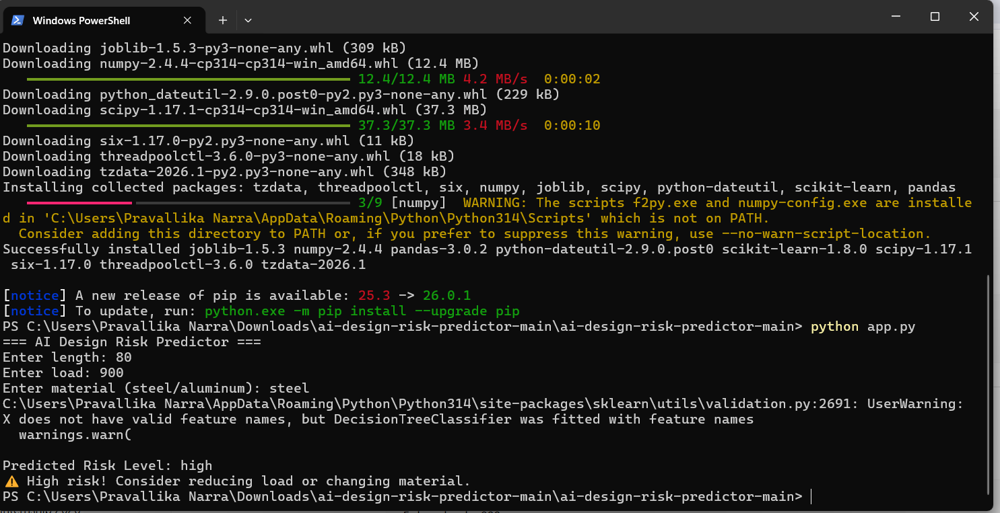

# ai-design-risk-predictor
## Live Demo
[Open Live Application](https://ai-design-risk-predictor-awft4jwwmsgqmlmkxaekyy.streamlit.app/)
Machine learning-based application to analyze design parameters and predict potential risks for improved engineering quality and reliability.
## Overview
This project is a machine learning-based system that analyzes engineering design parameters such as length, load, and material to predict potential risk levels. It simulates quality assurance processes used in engineering software to identify design issues early.
## Features
* Predicts risk levels (Low, Medium, High)
* Provides safety recommendations for design improvement
* Simulates early-stage design validation
## Tech Stack
* Python
* Scikit-learn
* Pandas
## Assumptions
* Higher load increases structural risk
* Aluminum is considered less strong compared to steel in this simulation
* Risk levels are estimated using simplified engineering rules
## Industry Relevance
This project reflects how engineering platforms use data-driven methods to detect potential design failures early, improving reliability and reducing risk in production systems.
## Future Improvements
* Integration with real CAD/BIM data
* Use of advanced machine learning models
* Deployment as a cloud-based testing service
## How to Run
Run `app.py` and enter input values:
* Length
* Load
* Material
The system will predict the risk level and provide recommendations.
## Example
Input:
length = 80, load = 900, material = steel
Output:
Predicted Risk: High
High risk. Review design parameters.
## Output Screenshot

